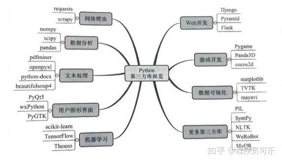

## 库

- requests
- scrapy
- wxPython
- BeautifulSoup
- NumPy
- pandas
- PyTorch
- Flask
- fastapi
- jinja2
- sqlalchemy
- Matplotlib
- numpy
- scipy
- pytest
- uvicorn
- dotenv




## 参考

- https://docs.python.org/zh-cn/3/
- https://www.numpy.org.cn/
- https://www.pypandas.cn/
- https://moviepy-cn.readthedocs.io/zh/latest/
- https://github.com/china-testing/python_cn_resouce/blob/main/fastapi.md
- https://docs.python.org/zh-cn/3/library/
- https://fastapi.tiangolo.com/zh/tutorial/
- https://github.com/AUTOMATIC1111/stable-diffusion-webui
- https://github.com/CompVis/stable-diffusion
- https://github.com/OpenTalker/SadTalker
- https://github.com/OpenTalker/video-retalking
- https://github.com/jina-ai/jina
- https://github.com/Evil0ctal/Douyin_TikTok_Download_API
- https://github.com/fastapi-admin/fastapi-admin
- https://github.com/paulpierre/RasaGPT
- https://github.com/chatchat-space/Langchain-Chatchat
- https://github.com/yzfly/awesome-chatgpt-zh
- https://17yongai.com/
- https://github.com/bleedline/aimoneyhunter
- https://liaokong.gitbook.io/llm-kai-fa-jiao-cheng/#chain-lian
- https://zhuanlan.zhihu.com/p/27400862
- https://zhuanlan.zhihu.com/p/387078089
- https://zhuanlan.zhihu.com/p/665396121
- https://zhuanlan.zhihu.com/p/657950165
- https://zhuanlan.zhihu.com/p/636577476
- https://segmentfault.com/a/1190000018002480


## 包管理

### Poetry

#### 安装 Poetry

- curl -sSL https://raw.githubusercontent.com/sdispater/poetry/master/get-poetry.py | python
- pip install --user poetry
- poetry --version

#### 基本用法

```bash
poetry init                 # 在已有的项目里使用，创建pyproject.toml文件
poetry new foo              # 创建新项目，foo文件夹
poetry install              # 创建虚拟环境，安装依赖，--no-dev选项不安装开发依赖
poetry shell                # 激活虚拟环境并执行命令
poetry run python app.py    # 显式激活虚拟环境
poetry add flask            # 安装依赖包
poetry add pytest --dev     # 安装开发依赖
poetry show                 # 查看所有安装的依赖
poetry show --tree          # 查看依赖关系
poetry show --outdated      # 查看可更新依赖
poetry update               # 更新所有锁定版本依赖
poetry update foo           # 更新某个指定的依赖
poetry remove foo           # 卸载包
poetry build                # 打包项目
poetry publish              # 发布项目
```

#### 常用配置
```bash
poetry config http-basic.pypi username password         # 写入PyPI账号密码信息
poetry config settings.virtualenvs.in-project true      # 设置在项目内创建虚拟环境文件夹
```

#### 设置PyPI镜像源
```toml
# pyproject.toml
[[tool.poetry.source]]
name = "douban"
url = "https://pypi.doubanio.com/simple/"
```

## fastapi
```
├── app
│   ├── __init__.py
│   ├── main.py
│   ├── dependencies.py
│   └── routers
│   │   ├── __init__.py
│   │   ├── items.py
│   │   └── users.py
│   └── internal
│       ├── __init__.py
│       └── admin.py
```

## 开发指南

### 入门阶段：

#### 1. 安装 Python：

首先，你需要在你的计算机上安装 Python。你可以从 [官方网站](https://www.python.org/) 下载最新版本的 Python。安装完成后，确保将 Python 添加到系统环境变量中。

#### 2. 学习基本语法：

- 变量和数据类型：了解变量的概念，学会使用不同的数据类型如整数、浮点数、字符串等。
- 控制流：学会使用条件语句（if、elif、else）和循环语句（for、while）。
- 函数：理解函数的定义和调用，学会编写自定义函数。

#### 3. 掌握基本数据结构：

- 列表：学会创建、访问和修改列表。
- 元组：了解元组的不可变性和使用场景。
- 字典：学会使用字典存储键值对，理解其在实际应用中的作用。

#### 4. 文件操作：

学会读写文件，了解文件对象的基本操作。

### 进阶阶段：

#### 1. 面向对象编程（OOP）：

学会使用类和对象，理解封装、继承和多态的概念。

#### 2. 异常处理：

掌握异常处理机制，学会使用 try、except 块来处理程序运行中的错误。

#### 3. 模块和包：

了解如何使用模块将代码组织成可重用的单元，学会创建和使用包。

#### 4. 正则表达式：

学习使用正则表达式进行文本处理，处理和匹配字符串模式。

#### 5. 文件操作：

深入学习文件的读写、复制和移动，以及文件系统的操作。

### 高级阶段：

#### 1. 并发和并行编程：

学会使用多线程和多进程进行并发和并行编程，提高程序的性能。

#### 2. 数据库操作：

了解数据库的基本概念，学会使用 Python 操作数据库，如 SQLite、MySQL 或 PostgreSQL。

#### 3. Web 开发：

学习使用框架如 Flask 或 Django 进行 Web 开发，了解 HTTP 协议和 RESTful API 设计。

#### 4. 数据科学和机器学习：

掌握使用库如 NumPy、Pandas、Matplotlib 和 Scikit-learn 进行数据分析和机器学习。

#### 5. 自动化和脚本编写：

学会使用 Python 编写自动化脚本，提高工作效率。

### 持续学习：

Python 是一个广泛应用的语言，持续学习是非常重要的。参与开源项目、阅读源代码、参加社区讨论是提高技能的好方法。

### 资源推荐：

- [Python 官方文档](https://docs.python.org/3/)
- [W3School Python 教程](https://www.w3schools.com/python/)
- [Codecademy Python 课程](https://www.codecademy.com/learn/learn-python)
- [Real Python](https://realpython.com/)

通过按照这个学习路线，你将逐步掌握 Python 编程的基础和高级技能。同时，不要忘记实际项目和实践是提高编程水平的关键。

在 Python 中，变量是用来存储数据值的标识符。每个变量都有一个名称，可以将不同类型的数据存储在变量中。同时，Python 是动态类型语言，这意味着你在创建变量时不需要指定数据类型，解释器会根据赋给变量的值自动确定其类型。

### 变量：

在 Python 中，变量的命名规则如下：

- 变量名可以包含字母、数字和下划线。
- 变量名不能以数字开头。
- 变量名区分大小写。
- 避免使用 Python 的关键字（如 `if`、`else`、`for` 等）作为变量名。

```python
# 变量的赋值
name = "John"
age = 25
height = 1.75
is_student = True
```

### 数据类型：

#### 1. 数字类型：

- **整数（int）：** 用于表示整数值，例如 `5`。
- **浮点数（float）：** 用于表示带有小数部分的数值，例如 `3.14`。

```python
# 数字类型的变量
integer_number = 5
float_number = 3.14
```

#### 2. 字符串类型：

- **字符串（str）：** 用于表示文本数据，可以使用单引号或双引号括起来。

```python
# 字符串类型的变量
name = "John"
greeting = 'Hello, World!'
```

#### 3. 布尔类型：

- **布尔（bool）：** 用于表示真（True）或假（False）的值。

```python
# 布尔类型的变量
is_student = True
is_adult = False
```

#### 4. 列表（List）：

- **列表：** 用于存储有序的元素集合，可以包含不同类型的数据。

```python
# 列表类型的变量
numbers = [1, 2, 3, 4, 5]
names = ["John", "Jane", "Doe"]
```

#### 5. 元组（Tuple）：

- **元组：** 与列表相似，但是元组是不可变的，一旦创建就不能被修改。

```python
# 元组类型的变量
coordinates = (3, 4)
colors = ("red", "green", "blue")
```

#### 6. 字典（Dictionary）：

- **字典：** 用于存储键值对，可以通过键访问值。

```python
# 字典类型的变量
person = {"name": "John", "age": 25, "city": "New York"}
```

这只是 Python 中一小部分的数据类型。理解这些基础的变量和数据类型是编程的基石，也是进一步学习 Python 编程的关键。在编写代码时，了解如何选择和使用不同的数据类型将使你的代码更加清晰、有效。
