### dumpsys 命令

- adb shell dumpsys activity | grep mFocusedApp #获取当前运行 activity 的名字
- adb shell dumpsys activity | grep mFocusedWindow
- adb shell dumpsys activity top
- adb shell dumpsys window | grep mCurrentFocus
- adb shell dumpsys activity activities
- adb shell dumpsys activity #查看 ActvityManagerService 所有信息
- adb shell dumpsys activity activities #查看 Activity 组件信息
- adb shell dumpsys activity services #查看 Service 组件信息
- adb shell dumpsys activity providers #产看 ContentProvider 组件信息
- adb shell dumpsys activity broadcasts #查看 BraodcastReceiver 信息
- adb shell dumpsys activity intents #查看 Intent 信息
- adb shell dumpsys activity processes #查看进程信息

### fastboot
- adb reboot bootloader
- fastboot devices
- fastboot getvar all             获取⼿机的全部信息
- fastboot getvar partition-type
- fastboot getvar unlocked
- fastboot reboot                 重启⼿机
- fastboot reboot-bootloader      重启到bootloader模式,其实就是再次进入fastboot
- fastboot -w reboot              清除手机中所有数据然后重启

- fastboot erase {partition}                      擦除分区
- fastboot erase boot                             擦除boot分区
- fastboot erase recovery                         擦除recovery分区
- fastboot erase system                           擦除system分区
- fastboot erase userdata                         擦除userdata分区
- fastboot erase cache                            擦除cache分区

- fastboot flash {partition} {*.img}              烧录img文件至对应分区
- fastboot flash boot boot.img                    写⼊boot分区
- fastboot flash recovery recovery.img            写⼊recovery分
- fastboot flash system system.img                写⼊system分区

- fastboot boot <内核镜像文件名或路径>              临时启动镜像，不会烧录和替换内核文件到存储中
- fastboot oem device-info                         输出当前BL锁状态(非MTK)
- fastboot oem lks                                 输出当前BL锁状态(MTK)
- fastboot oem poweroff                           拔掉数据线后关机
- fastboot oem lock                               重新上BL锁并清空所有数据(需未开启root)
- fastboot oem unlock                             解除BL锁并清空所有数据,小米手机必须绑定账号,主动申请解锁,等待7天,使用工具才行
- fastboot flashing unlock                        解锁设备

### 常用命令

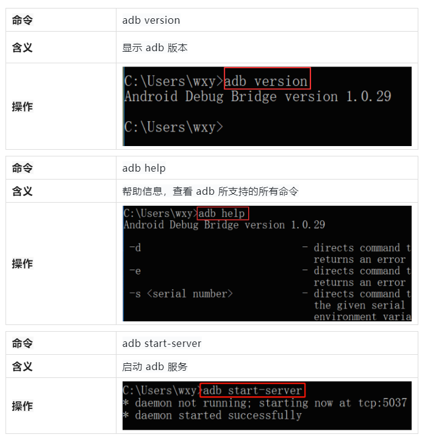
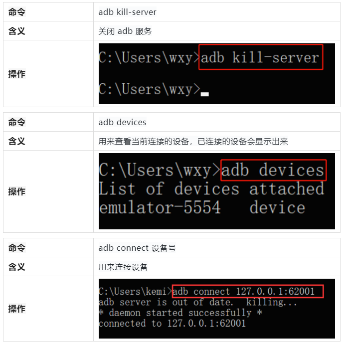
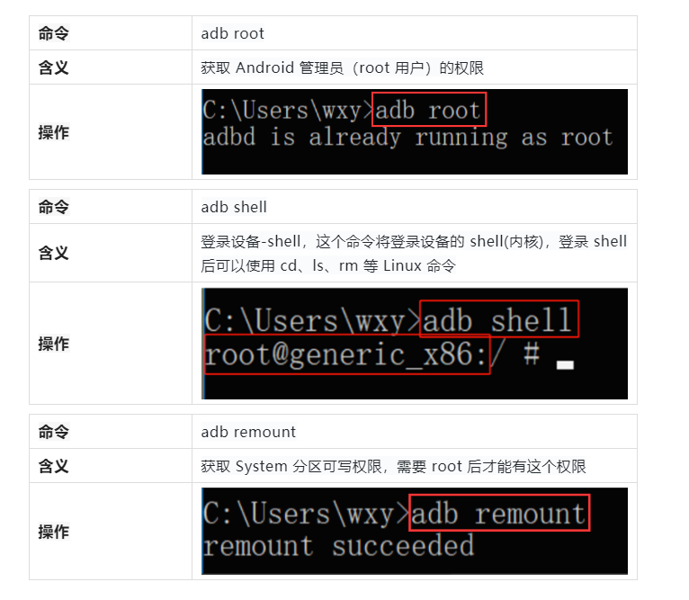
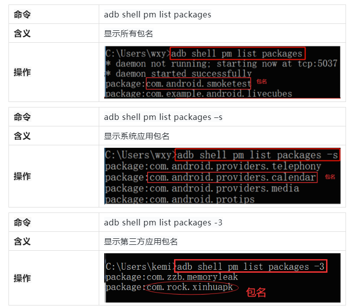
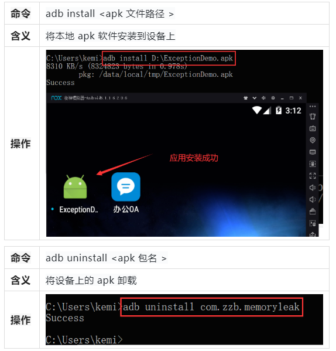
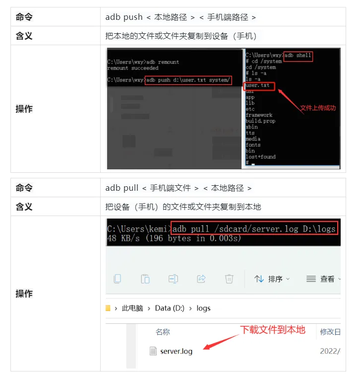
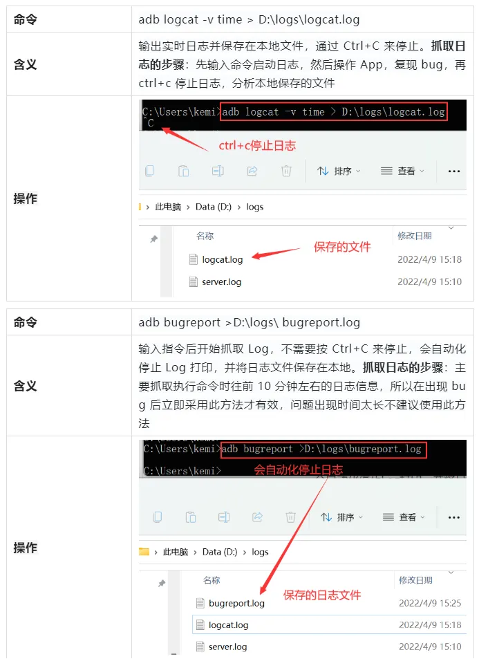
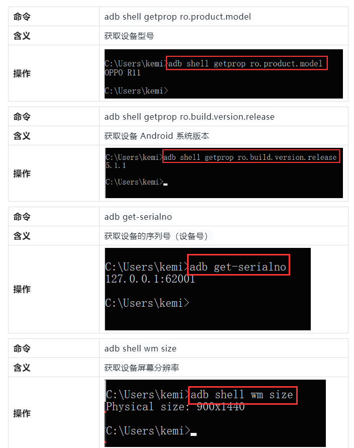
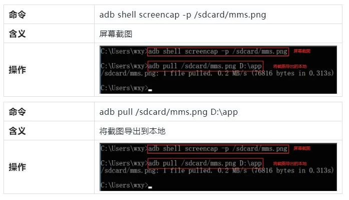
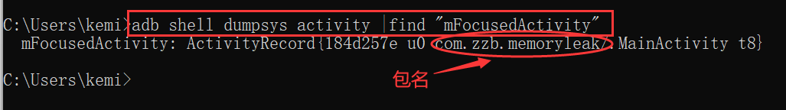
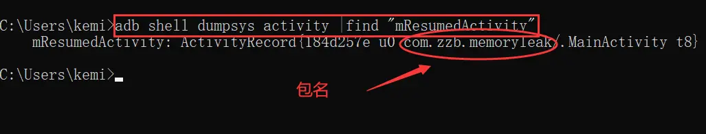

