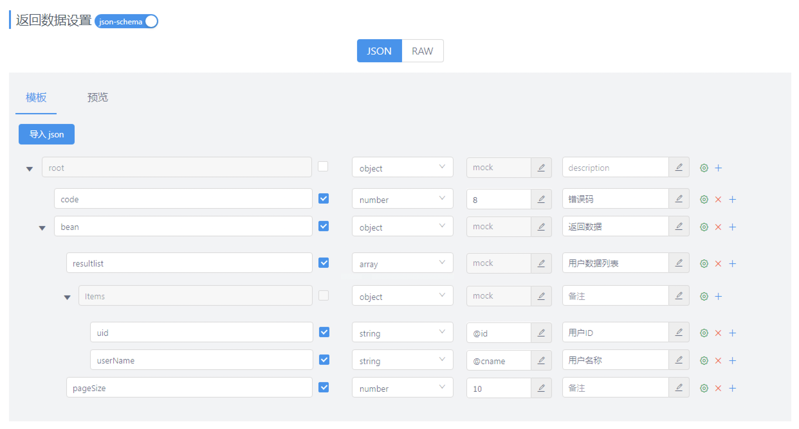

### yapi数据mock方式
#### 方式1. mockjs

*基于 json + 注释 定义 mock 数据*

- 说明
1. 返回数据设置为关闭状态


```json
{
		  "code": 8,
		  " bean": {
		    "resultlist|20": [ //20个元素的数组
		      {
		        "uid": "@id", //使用Mock.Random.id占位符方法，自动生成随机ID
		        "userName": "@cname" //使用Mock.Random.cname占位符方法，自动生成中文姓名
		      }
		    ]
		  }
}
```

```json
//输出：
	{
	  "code": 8,
	  " bean": {
	    "resultlist": [
	      {
	        "uid": "370000198203094191",
	        "userName": "江娟"
	      },
	      {
	        "uid": "120000199803268739",
	        "userName": "白刚"
	      },
	      {
	        "uid": "460000197906055575",
	        "userName": "孟静"
	      },
	      {
	        "uid": "340000197502194897",
	        "userName": "石磊"
	      },
	      {
	        "uid": "420000200803192478",
	        "userName": "何杰"
	      },
	      {
	        "uid": "340000197202020449",
	        "userName": "何静"
	      },
	      {
	        "uid": "440000200910173655",
	        "userName": "张艳"
	      },
	      {
	        "uid": "710000198006251278",
	        "userName": "黄洋"
	      },
	      {
	        "uid": "120000197210122356",
	        "userName": "郑洋"
	      },
	      {
	        "uid": "820000198209228663",
	        "userName": "熊桂英"
	      },
	      {
	        "uid": "820000197603267439",
	        "userName": "卢勇"
	      },
	      {
	        "uid": "530000197109214834",
	        "userName": "范敏"
	      },
	      {
	        "uid": "360000200202224642",
	        "userName": "锺艳"
	      },
	      {
	        "uid": "530000199103138059",
	        "userName": "胡军"
	      },
	      {
	        "uid": "820000199006082582",
	        "userName": "郝娟"
	      },
	      {
	        "uid": "440000200801243183",
	        "userName": "张娜"
	      },
	      {
	        "uid": "350000197408090620",
	        "userName": "戴娜"
	      },
	      {
	        "uid": "460000198908034502",
	        "userName": "江强"
	      },
	      {
	        "uid": "450000198511089183",
	        "userName": "江平"
	      },
	      {
	        "uid": "340000200103232758",
	        "userName": "曹强"
	      }
	    ]
	  }
	}
```
#### 方式2. json-schema

*<u>开启 json-schema</u> 功能后，使用<u>可视化界面</u>方式，根据 json-schema 定义的数据结构，生成随机数据*

- 说明
1. 返回数据设置为开启状态
2. mock输入框：输入Mock.Random的方法占位符
3. 点击设置按钮可以打开**高级设置**窗口
4. 最小元素个数和最大元素个数输入框：表示产生数组元素的个数

<u>注意：mockjs方式和json-schema方式只能二选一，也就是说，json-schema和mockjs只会保存一套，后面配置会覆盖前面配置</u>




```json
//输出：
{
  "code": 8,
  "bean": {
    "resultlist": [
      {
        "uid": "44000019800528008X",
        "userName": "范洋"
      },
      {
        "uid": "350000197312277183",
        "userName": "魏杰"
      },
      {
        "uid": "630000200303018106",
        "userName": "周桂英"
      },
      {
        "uid": "340000201007185132",
        "userName": "萧刚"
      },
      {
        "uid": "42000020010424745X",
        "userName": "熊静"
      },
      {
        "uid": "420000197510227863",
        "userName": "阎娜"
      },
      {
        "uid": "510000201212251188",
        "userName": "贾刚"
      },
      {
        "uid": "370000199601061533",
        "userName": "孔丽"
      },
      {
        "uid": "630000200009046886",
        "userName": "夏桂英"
      },
      {
        "uid": "31000019940118145X",
        "userName": "徐刚"
      }
    ],
    "pageSize": 10
  }
}
```


#### 方式3. Mock期望

*根据设置的请求过滤规则，返回期望数据*

- 说明
1. 点击 **高级Mock**  -->  **期望**  -->  **添加期望**


#### 方式4. 自定义脚本

*对于某些接口，业务相对复杂，而 UI 端也需要根据接口返回的不同内容去做相应的处理，可以根据用户请求的参数修改返回内容*

- 说明
1. 点击 **高级Mock**  -->  **脚本**  -->  **开启**

   

- 全局变量
  1. 请求

			```tex
		header		请求头
		cookie		请求Cookies
  	params	  请求参数，包括 Body、Query中所有参数
		```
		
	2. 响应
		```tex
		httpCode 		响应HTTP状态码，默认200
		resHeader		响应头
		delay 		 	响应延时，单位为ms
		mockJson 		响应Mock数据
		Random 			可以调用Mock.Random方法
		```
		
```js
//脚本
delay = 300;
mockJson = {
    code: 8,
    bean: {
        resultlist: Array.from(new Array(10).keys()).map(i => {
            return {
                uid: Random.id(),
                userName: Random.cname()
            };
        }),
        pageSize: 10
    }
};
```

```json
//输出：
{
    "code": 8,
    "bean":
    {
        "resultlist": [
        {
            "uid": "120000201705233831",
            "userName": "于秀英"
        },
        {
            "uid": "130000202201247144",
            "userName": "邓军"
        },
        {
            "uid": "220000201512230785",
            "userName": "万洋"
        },
        {
            "uid": "340000199209136750",
            "userName": "许洋"
        },
        {
            "uid": "460000199702233826",
            "userName": "廖超"
        },
        {
            "uid": "630000198903226179",
            "userName": "赵丽"
        },
        {
            "uid": "430000200902047622",
            "userName": "邱军"
        },
        {
            "uid": "460000198809035577",
            "userName": "夏娟"
        },
        {
            "uid": "500000199008158144",
            "userName": "阎静"
        },
        {
            "uid": "14000019800304279X",
            "userName": "曹洋"
        }],
        "pageSize": 10
    }
}
```

```js
//脚本
mockJson = {
    header,
    cookie,
    params
};
```

```json
// http://192.168.1.171:5555/mock/518/test?uid=123
//输出：
{
    "header":
    {
        "host": "192.168.1.171:5555",
        "connection": "keep-alive",
        "upgrade-insecure-requests": "1",
        "user-agent": "Mozilla/5.0 AppleWebKit/537.36 (KHTML, like Gecko) Chrome/102.0.0.0",
        "accept": "text/html",
        "accept-encoding": "gzip, deflate",
        "accept-language": "zh-CN,zh;q=0.9",
        "cookie": "_yapi_token=eyJhbGciOiJIUzI1NiIsInR5cCI6IkpXVCJ9.eyJ1aWQiOjk3LCJpYX7"
    },
    "cookie":
    {
        "_yapi_token": "eyJhbGciOiJIUzI1NiIsInR5cCI6IkpXVCJ9.eyJ1aWQiOjk3LCJpYX7",
        "_yapi_uid": "97"
    },
    "params":
    {
        "uid": "123"
    }
}
```

```js
//脚本
mockJson = {
    httpCode,
    resHeader,
    delay,
    mockJson
};
```

```json
//输出：
{
    "httpCode": 200,
    "resHeader": {},
    "delay": 200,
    "mockJson":
    {
        "code": 8
    }
}
```


### Mock优先级

```tex
Mock期望 > 自定义脚本 > 项目全局脚本 > 普通Mock
```


### mockjs参考文档

- mock库使用说明
- 语法规范 https://github.com/nuysoft/Mock/wiki/Syntax-Specification
- 占位符说明文档 https://github.com/nuysoft/Mock/wiki/Mock.Random
- 示例 http://mockjs.com/examples.html


### json-schema参考文档

- https://blog.csdn.net/pyfysf/article/details/103526022


### 体验地址

- http://yapi.smart-xwork.cn/